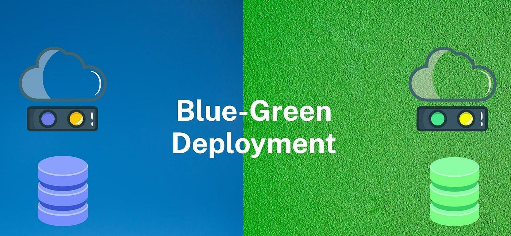
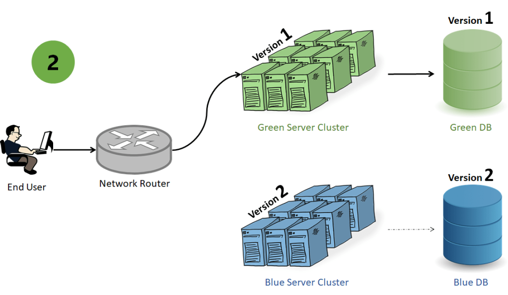

   

# Argo Rollouts: Blue/Green Deployment

Ainda a respeito do Argo Rollouts, desta vez trataremos do caso de uso do Blue/Green deployment e é claro o que seria esse tipo de implementação e como ela funciona.

⚠️ Alerta de texto grande ⚠️

## O que é

Implementação Azul-Verde ou Blue/Green é uma **estratégia** de lançamento de software que visa **minimizar o tempo de inatividade/downtime** e **reduzir** o risco associado à implantação de novas versões de um aplicativo.

A **versão antiga** é chamada de Blue, enquanto a **versão nova** é a Green. O Ponto interessante aqui é que podemos controlar o tráfego para essa nova versão e além disso isolar ela completamente, onde, somente usuários autorizados vão ter acesso ao respectivo DNS de teste, estes usuários podem ser o time de testes, time de segurança e outros.

A **diferença** entre Blue/Green 

**Exemplo de funcionamento abaixo:**

 

 

## Manifestos de configuração:

Você pode verificar os manifestos de configuração [clicando aqui](../../Kubernetes/flask-app-bluegreen/)   

## 💣 Caso de Uso: 

Imagine que você trabalhe para uma instituição financeira que tem serviços como transferência bancária, **PIX**, conta corrente e/ou salário, portabilidade e outras features comuns em aplicativos bancários.

Para ser mais direto, imagine que você atua no time do **PIX**, que é o carro-chefe da instituição, se ele falhar, uma boa quantia em dinheiro se perde e, talvez, algumas pessoas **"vão de open to working"**.

Portanto, o time de desenvolvimento do PIX decide lançar uma nova atualização e pronto, o caos está feito, centenas de aprovações necessárias, validações, medos, angústia e outros problemas vão aparecer, o PIX é um **serviço crítico** da empresa, portanto, não pode gerar downtime essa atualização.

Com o Blue/Green Deployment, não é necessário efetuar essa atualização tarde da noite, visto que pode ser em horário comercial, até mesmo no primeiro dia útil do mês e em uma segunda-feira por conta que o Blue/Green controla o tráfego da nova versão e antiga versão, isto é, a nova versão, só terá acesso à ela os respectivos desenvolvedores, time de teste, time de segurança, um grupo seleto de pessoas que vão testar ponto-a-ponto a nova atualização, enquanto a versão antiga é mil maravilhas, visto que ela está em produção e recebendo requisições reais sem problemas.

## 🔍 Pontos do caso de uso

* Com o Blue/Green, você controla o impacto que terá uma atualização.
* Evita, na maiorida dos casos, horas extras, para subir atualizações (RDMs/Requisição de Mudança)
* Problemas de compatibilidade com a nova versão, visto que ela pode ser testada por um grupo seleto de pessoas autorizadas.
* Não gera Downtime e muito menos impacto no cliente final quando uma nova release está pronta para a produção. 
