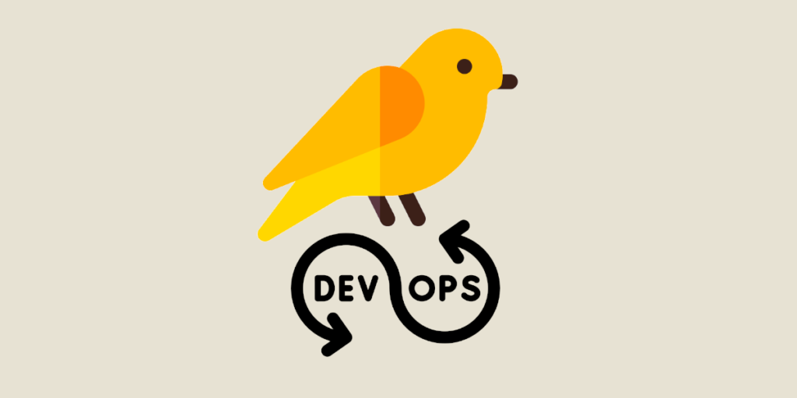
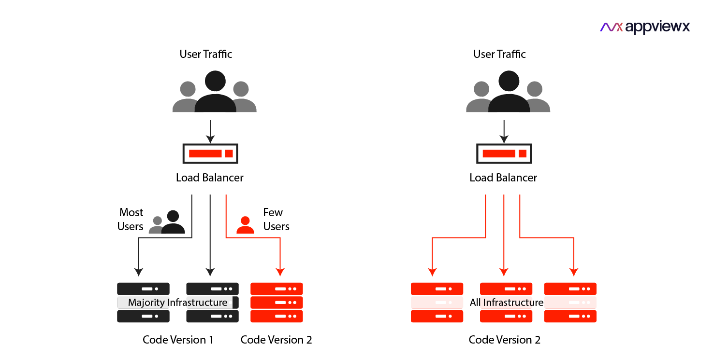

   

# Argo Rollouts: Canary Deployment

Já sabemos que o Argo Rollouts é um controller do Kubernetes e uma série de CRDs (Custom Resources) que providenciam uma série de implementações (deployments) avançados e com configurações únicas em cada um.

⚠️ Alerta de texto grande ⚠️

## O que é

Em DevOps, um deployment Canary é uma das diversas estratégias existentes, porém o foco é permitir uma implementação **gradual** de uma nova versão de software para um subconjunto de **usuários** que se chamam **canários**, após essa nova versão ser testada por esse conjunto de usuários, a versão nova em sua totalidade será liberada para os demais usuários.

Essa é uma abordagem extremamente controlada onde permite testar a nova versão em um ambiente real, coletar o feedback e identificar potenciais problemas, reduzindo um grande risco de downtime ou incompatibilidades com os dispositivos do usuário.

**Exemplo de funcionamento abaixo:**

   

## Manifestos de configuração:

Você pode verificar os manifestos de configuração [clicando aqui](../../Kubernetes/flask-app-canary/)   

## 💣 Caso de Uso: Mobile em Prod

**Veja agora um exemplo de caso de uso:** Imagine que o time de desenvolvimento de aplicativos móveis deseja subir uma nova versão do seu app no **Google Play Store**, a versão atual está com alguns problemas de lentidão e diversos usuários relataram uma incompatibilidade com o app em seus dispositivos.

O Aplicativo em si, é um Banco, com funcionalidades de um app de Banco digital.

O time de desenvolvedor decide que, as 23h00 da noite de uma **sexta-feira** vão subir essa nova versão, reune todos os responsáveis pelo projeto e principalmente o time de DevOps, que pontualmente, sobe a nova versão.

Realizam **testes manuais** e tiram a conclusão que, em seus dispositivos, o aplicativo funciona perfeitamente, portanto, essa nova versão foi um sucesso.

**Porém**, como nem tudo são flores, na segunda-feira, logo pela manhã, diversos usuários relatam problemas com a nova versão, e esses problemas geram um ainda maior: **Perda de dinheiro**.

Quando se trata de dinheiro, nem uma empresa gosta de perder, dito isso, abrem uma **War room**, famosa sala de guerra e começam a procurar os culpados.

Essa abordagem, embora rotineira, está totalmente errada.    

## 🔍 Pontos do caso de uso

Procurar por um responsável/culpado é sempre um problema, por conta que pode gerar uma frustração no funcionário responsável pela implementação da nova versão, perda de funcionário e até mesmo **processos judiciais** pelo motivo de: Assédio moral e outros.

Portando, **jamais procure um culpado**

A culpa é de um todo, desde o simples funcionário até a empresa no geral, que não estabeleceu processos, testes e outras coisas de forma mais concisa.

**E agora vem o pulo do gato**: Como eu impeço isso?

Simples, utilize o **Canary**, ele vai te permitir que durante o dia, em qualquer horário, faça atualizações em produção de forma **controlada**, neste caso de uso, poderíamos liberar 25% do Tráfego para a nova versão, onde **usuários reais** testariam e mandaríam um feedback. 

Caso houvesse um problema nesses 25%, simples, efetuaríamos um **rollback**, coletaríamos seus feedbacks e os Desenvolvedores vão trabalhar em cima dos problemas encontrados. 

