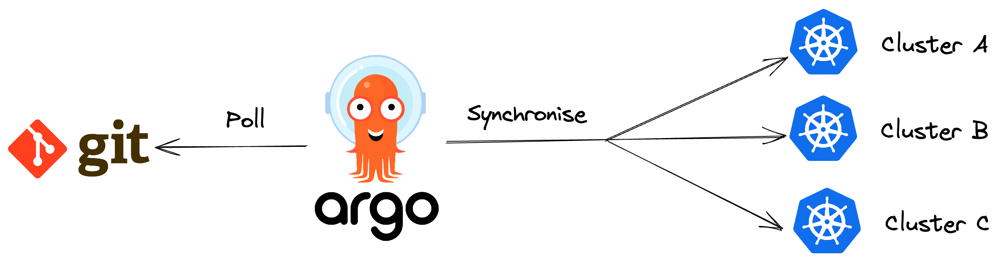

 <br><br>

**ÍNDICE**

* [1 - Estrutura do diretório](#estrutura-do-diretório)
* [2 - GitOps](#gitops)
* [3 - Argo Rollouts vs k8s Deployments](#argo-rollouts-vs-k8s-deployments)
* [4 - Criando POD de teste](#criando-pod-de-teste)
* [5 - Teste Blue/Green](#teste-do-bluegreen-service)
* [6 - Teste Canary](#teste-do-canary-service)

## Estrutura do diretório

| DIRETÓRIO | OBJETIVO | 
---| ---| 
 📁 argo-apps | APPS do ArgoCD via Manifesto/CRDs do proprio argocd
 📁 flask-app-bluegreen | Contém os manifestos do Argo Rollouts coma strategy: BlueGreen
 📁 flask-app-canary | Contém os manifestos do Argo Rollouts com a strategy: Canary

## GitOps

O ArgoCD utiliza com base o GitOps para seu controle, mas o que é GitOps?

O GitOps é um padrão operacional que utiliza o Git como principal e única fonte da verdade para desejar o estado da infraestrutura, usando em conjunto com o ArgoCD, resumidamente, oque está no diretório do GitOps e for um arquivo Kubernetes, ele tem que estar dentro do cluster.

Portanto, seguindo as boas práticas, como esta organizado em nosso laboratório, isto dentro do AWS CodeCommit:

- 01 Repositório da aplicação: flask-app
- 02 Repositório de manifestos do Canary: flask-app-canary
- 03 Repositório de manifestos do Blue/Green: flask-app-bluegreen

**Onde o GitOps + ArgoCD vai atuar**: No **segundo** e **terceiro** repositório, sendo o repositório da aplicação de uso exclusivo pelo CI/CD e o desenvolvedor. 

Como pode observar, cada diretório tem o mesmo nome, isso não é uma mera coincidência e sim uma padronização de exemplo, onde cada diretório, na teoria, é um repositório que contém o seus arquivos.

Abaixo um exemplo:



<br><br>

## Comandos uteis


### Criando POD de teste
> 01 - Run & Access nginx pod
```bash
kubectl run --image nginx nginx
kubectl exec -it nginx -- bash
```

### Teste do Blue/Green service:

> 01 - Create a simple nginx pod
```bash
kubectl run nginx --image nginx -n flask-app-hml
```

> 02 - Acess the pod
```bash
kubectl -n flask-app-hml exec -it nginx -- bash
```

> 03 - Active
```bash
curl flask-bluegreen-active-svc.flask-app-hml.svc.cluster.local:80
```

> 04 - Preview
```bash
curl flask-bluegreen-preview-svc.flask-app-hml.svc.cluster.local:80
```

### Teste do Canary Service:

> 01 - Canary:
```bash
curl flask-app-canary-svc.flask-app-hml.svc.cluster.local:8080
```

### Promote Rollout App para uma nova versão:

> 06 - Promote the new version
```bash
kubectl-argo-rollouts promote <-n namespace if exists> <name-of-rollout-deployment>
```

> OBS: Após executar o promote, só aguardar.