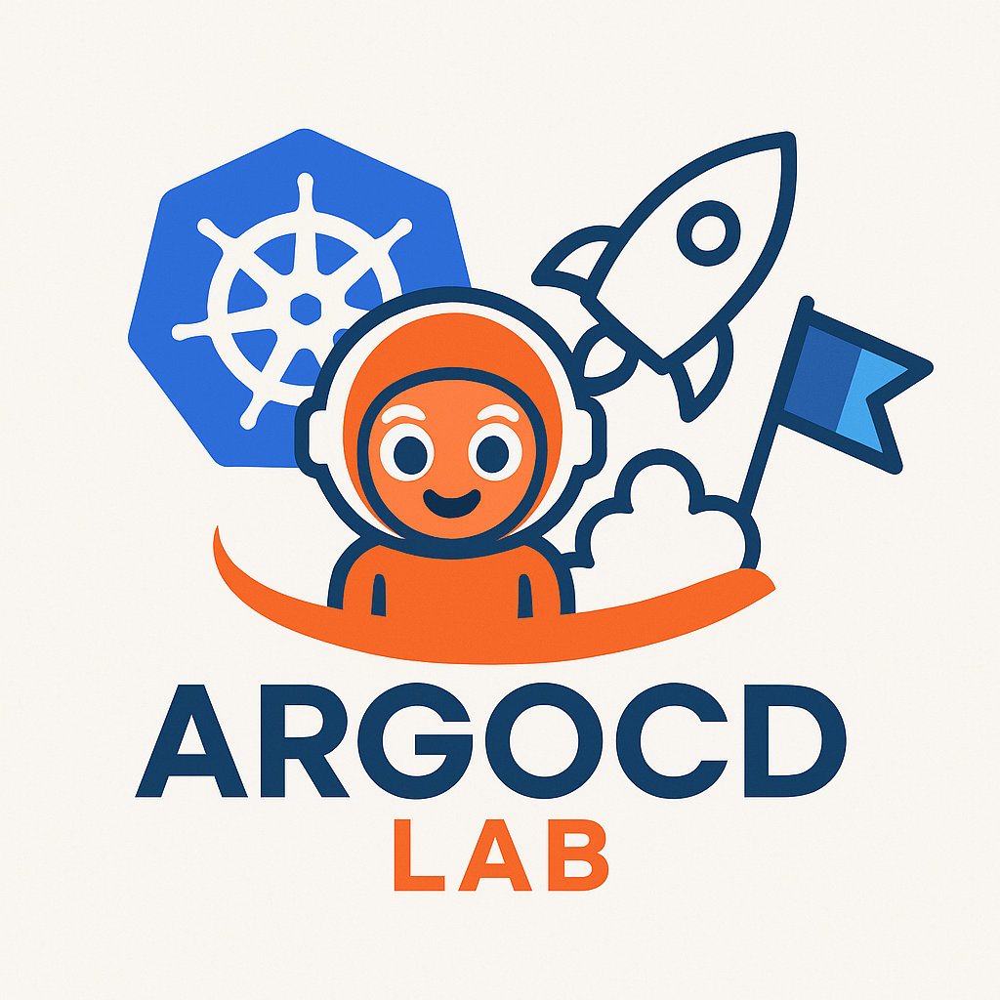

<div align="center"></div><br><br>

# ArgoCD and Argo Rollouts - SandBox Environment

Neste repositório você terá acesso a todas as ferramentas utilizadas para realizar a instalação, configuração e testes do ArgoCD Rollouts.

**Uma breve descrição a respeito:**

O ArgoCD Rollouts, ou melhor, Argo Rollouts é um controler e um conjunto de recursos customizados (Custom resources) do Kubernetes que permite a entregá progressiva de aplicações no Kubernetes.

Ele extende o recurso nativo do Kubernetes (Deployments) com um recurso avançado de Rollout, neste repositório vamos trabalhar com "três", sendo eles:

* **Canary**
* **Rollback**
* **Blue/Green**

Mais a frente, com uma leve ênfase, explicarei em resumo o que cada tipo de "entrega" faz. <br><br>

<div align="center">
    O Laboratório foi feito utilizando o AWS Sandbox da:
    <br>
</div>

## INDEX

**PARTE 01: Introdução**
*   * [Tecnologias utilizadas](#tecnologias-utilizadas)
*   * [Por que o ArgoCD?](#por-que-o-argocd)
*   * [Organização do repositório](#organização-do-repositório)
*   * [Iniciar o Laboratorio](#como-iniciar-o-lab)


## Tecnologias utilizadas

<div align="center">
    
    
    
    
    
    
    
    
    
    
    
    
    

</div>

## Por que o ArgoCD?

O ArgoCD é uma ferramenta amplamente utilizada por diversas equipes de DevOps ao redor do mundo, e é claro, é uma ferramenta aprovada pela CNCF (Graduated) e mantida pela **The Linux Foundation**.

É uma ferramenta que permite a entrega contínua (CD), declarativa e open-source, baseada totalmente no GitOps para o Kubernetes. Permite automatizar a implementação de aplicações, sincronizando o estado desejado e definido em um repositório Git. Em outras palavras, o que estiver no repositório Git, o ArgoCD faz questão de garantir que ele seja aplicado dentro do Kubernetes (na questão de manifestos k8s).

Alguns pontos interessantes:

* Estado desejado: O Estado desejado de sua aplicação é definido em arquivos de config (Yaml, Kustomize, Helm ou outros) e são armazeandos em Git
* Monitoramento Contínuo: O ArgoCD monitora continuamente o seu cluster Kubernetes e o repositório Git
* Comparação e Sincronização: Compara o estado atual do seu cluster com o estado desejado do Git e identifica desvios
* Reconciliação: Se houver desvios, o ArgoCD pode automaticamente reconciliar (sincronizar) o estado do seu cluster com o estado desejado ou, opcionalmente, permitir que um operador faça isso manualmente 
* Git como fonte de verdade: O Git se torna a única fonte confiável para o estado da sua aplicação, facilitando o versionamento, auditoria e rollback de implantações. 

Abaixo uma imagem que descreve, em resumo, o funcionamento do ArgoCD: <br>


<br><br>

Mais adiante eu o convido a explorar mais a respeito do repositorio e por fim iniciar esse laboratório.

Qualquer problema na execução ou falha do script, peço que me contate nas redes que deixarei no fim deste **README.md**, desejo um bom resto de dia e bons estudos à você! 👍

## Organização do repositório

| DIRETÓRIO | OBJETIVO | DOCUMENTAÇÃO
---| ---| ---|
📁 Ansible | Scripts, localizado dentro do diretório playbooks/. São utilizados para instalar e configurar o laboratório | [Documentação Ansible](./Ansible/)
📁 App | Código em Flask utilizado como base | [Documentação do APP](./app/)
📁 ArgoCD | Documentações do ArgoCD como: Canary e Blue/Green deployments, usuários e roles | [Documentação ArgoCD](./ArgoCD/)
📁 Kubernetes | Contém todos os manifestos utilizados e uma breve documentação sobre | [Documentação k8s](./Kubernetes/)
📁 Terraform | Contém módulos do Terraform e toda infraestrutura baseada em IaC | [Documentação do Terraform](./Terraform/)
📁🐍 Common | Contém todos os códigos/scripts em Python utilizado para providênciar de forma automática o Laboratório | [Documentação dos scripts Python](./common/)
📁🔑 security | Permissões que você precisa ter na sua conta AWS | [Documentação das permissões](./security/) 
📁 images | Imagens utilizadas pelo repositório | ❌ 


## Como iniciar o Lab?

⌚️ **Tempo de execução para criar: 13 minutos**

O Laboratório **"roda"** interiamente dentro do ambiente **AWS** e será necessário algumas permissões listadas abaixo. 


**REQUISITOS MÍNIMOS**

- Sistema operacional: Linux (Preferencialmente: Ubuntu/Debian)
- Python3.x
- AWS CLI
- AWS Configure **(Credenciais previamente configurada)**
- Ansible
- Terraform
- **Permissões**: [CLIQUE AQUI PARA VISUALIZAR AS PERMISSÕES NECESSÁRIAS](./security/)

**01 - Configure a variável de ambiente: AWS_USER_NAME**
```bash
# LINUX
export AWS_USER_NAME="<YOU_AWS_USER_NAME>"
```
```powershell
# Powershell
$Env:AWS_USER_NAME = "<YOUR_AWS_USER_NAME>"
```
```cmd
REM cmd/command prompt 
set AWS_USER_NAME=<YOUR_AWS_USER_NAME>
```

**02 - Instale as dependências**
```bash
pip install -r requirements.txt
# ou
python -m pip install requirements.txt
# ou
python3 -m pip install requirements.txt
```

**03 - INICIALIZE O SCRIPT**
```bash
python init.py
```

**04 - ESCOLHA A OPÇÃO 01**
```bash
Opção 1: Configure Environment
Opção 0: Delete Environment

SELECT AN OPTION: 1
```

* Aguarde até a execução total do script, atente-se aos **outputs** (saídas).


<br>


<div align="center">

🚨🚨🚨

████████████████████████████████████████████████████████ ██ ██ ██ 🚨
<li>Atente-se as permissões utilizadas para a realização do laboratório</li> 
<li>Atente-se na etapa manual do script, requisitará acesso elevado no Linux!</li>
<li>Script verboso, significa que qualquer erro será mostrado no terminal, portanto, não o interrompa</li> <br>

🚨 ██ ██ ██ ████████████████████████████████████████████████████████

<div>

---
<br>

<div align="center">
    Laboratório produzido por: José Silva 🚀
    <br><br>
    <a href="https://www.linkedin.com/in/jgsiqueiraa/">
        
    </a>
    <a href="https://github.com/cl0uD-C1SC0">
        
    </a>
</div>
